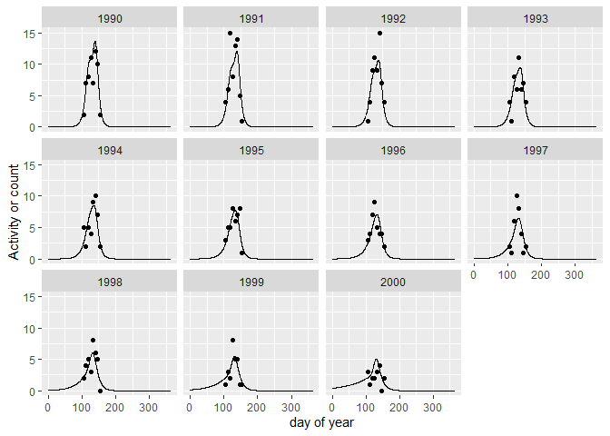

<!-- README.md is generated from README.Rmd. Please edit that file -->

# butterflyGamSims

## Installation

You can install butterflyGamSims from [GitHub](https://github.com/)
with:

``` r
# install.packages("devtools")
devtools::install_github("cbedwards/butterflyGamSims")
```

## Description

### Motivation

In ecology and in conservation biology, understanding the population
trends and timing of activity (“phenology”) for insects is an ongoing
interest / concern. Particularly in the context of climate change,
ecologists are interested in identifying trends in phenology (IE
populations shifting to become active earlier, or later, or changing
length of time they are active within the year). These shifts in
phenology are one of the clearest signals of climate change on
populations ([Parmesan 2006](https://www.jstor.org/stable/30033846)),
and there are concerns that shifts in phenology could lead to mismatches
between populations and their food sources ([Miller-Rushing et
al. 2010](https://doi.org/10.1098/rstb.2010.0148)), or lead to
“developmental traps” in which populations try to squeeze in an
additional generation that fails to develop before the end of their
viable season ([Kerr et al. 2019](https://doi.org/10.1111/gcb.14959)).

Because of their visibility and charisma, butterflies are particularly
well-represented in long-term ecological data (for example, the
[UKBMS](https://ukbms.org/) is a systematic butterfly monitoring program
that has been running since 1976). The richness of butterfly data allows
us both to explore the specific dynamics of individual butterfly species
and to use them as a general proxy for possible trends in insects in
general. (Although butterflies are an imperfect stand-in for other
insects, and there is a ton of great work going into systematic surveys
of other taxa!). Given the relative wealth of butterfly data, it’s
important to have tools to translate butterfly observations into
estimates of abundance and phenology.

One of the most common forms of butterfly data are repeated transect
counts, in which scientists or volunteers walk a fixed route multiple
times per year and report the number of butterflies they saw of one or
more species on each day that they censused (e.g. [Pollard
1977](https://doi.org/10.1016/0006-3207(77)90065-9)). As an example of
the depth and breadth of transect data available, check out
[Pollardbase](https://www.pollardbase.org/), in which [Prof. Leslie
Ries](https://www.butterflyinformatics.org/person/leslie-ries) have
taken on the Herculean task of aggregating, cleaning, and integrating
repeated transect counts from programs across the US.

There are a number of tools for translating these repeated transect
counts to estimates of abundance or phenology, including Bayesian
approaches as in [Lindén and Mäntyniemi
2011](https://doi.org/10.1890/10-1831.1) and [Champan et
al. 2015](https://doi.org/10.1111/bij.12515), fitting Gaussian curves
with regression models as described in [Edwards and Crone
2021](https://doi.org/10.1111/oik.08368), or fitting the Zonneveld model
[Zonneveld 1991](https://doi.org/10.1111/j.1365-2311.1991.tb00198.x) as
with the [INCA](https://www.urbanwildlands.org/INCA/) tool. One of the
most flexible approaches is to fit smoothing splines (a form of
generalized additive models (GAMs)) to the data in order to estimate the
yearly activity curves, from which we can estimate abundance index and
phenology metrics (e.g. [Hodgson et
al. 2011](https://doi.org/10.1111/j.1365-2486.2010.02308.x), [Wepprich
et al. 2019](https://doi.org/10.1371/journal.pone.0216270), [Stemkovski
et al. 2020](https://doi.org/10.1111/ele.13583)). The flexibility of
smoothing splines is particularly valuable when working with species
that can have more than one generation per year, or can have unusual
activity curves (for example, when male and female become active at
different times). However, the flexibility of GAMs comes at a cost; when
data is sparse, GAMs can predict unreasonable activity periods that lead
to incorrect and/or biased estimates of abundance or phenology. One
solution would be to throw out species or years with sparse data, but
doing so can bias our understanding of individual species and
across-species trends ([Didham et
al. 2020](https://doi.org/10.1111/icad.12408)).

**Long story short**, we need to be able to test how reliable different
variations of GAM models are, and if there are rules for excluding years
with insufficient data that balance our need for reliable estimates of
abundance and phenology with our desire not to exclude years or species
with sparse data. **butterflyGamSims** simulates transect data for
biologically reasonable butterfly activity with reasonable sampling
variation, then fits the data with the specified GAM model and estimates
trends in abundance and phenology across years, using the specified
rules for excluding potential problem years. Because the data is
simulated, we know what the *true* trends in the population are, so we
can evaluate how well our methods worked.

### Using this package

My primary motivation for creating this package was to compare estimated
and real trends in abundance and phenology for a range of GAM approaches
and data censoring options to identify potential biases when fitting
real data. In particular, in exploring real data, I found that for
sufficiently sparse data in which abundance declined across a time
series, apparent trends in phenology became wildly unreliable without
some rule for removing years with insufficient data. This package allows
systematic exploration of *what* rules for removing data are sufficient
to avoid notable bias.

For this purpose, `butterfly_gam_sim()` and `butterfly_load()` are the
key functions. `butterfly_gam_sim()` takes all the arguments needed to
define the data to be simulated, the GAM-fitting parameters, and the
data filtering protocol. See `?butterfly_gam_sim` for details on all the
arguments (and a simple example). `butterfly_load()` reads in the files
saved by a run of `butterfly_gam_sim()` and organizes them into a single
list; `?butterfly_load` contains all the relevant information for
interpreting the simulated time series, estimated yearly metrics, and
estimated trends.

Because **butterflyGamSims** necessarily simulates butterfly time series
data, the time-series simulation function `timeseries_sim()` may be
helpful for other projects (IE simulated data for teaching/training,
other methods-testing projects). Note that `timeseries_sim()` returns a
set of simulated time series; depending on your needs,`timeseries_gen()`
(which saves the time-series to a .csv file instead) may be more
helpful.

For visualizing simulated time-series and associated fitted GAM models,
`timeseries_examples()` and `fit_plotter()` may be helpful. As a simple
example, here we simulate a 10-year time series with a Gaussian
underlying activity curve centered on day 130 with standard deviation
15, a starting abundance index of 500, a moderate exponential decline in
population across years, and 7 census per year with poisson sampling
error.

``` r
library(butterflyGamSims)
timeseries_examples(years = 1990:2000,
                    doy.samples = seq(105,160, by = 7),
                    abund.type = "exp",
                    activity.type = "gauss",
                    sample.type = "pois",
                    growth.rate = -0.12,
                    init.size = 500,
                    act.mean = 130,
                    act.sd = 15)
```


And here we fit a similar time-series with a simple gam (using a tensor
product smooth with a cubic regression smooth in both the day-of-year
and the year dimensions, and 5 knots in the doy direction),

``` r
dat.sim = timeseries_generator(years = 1990:2000,
                               doy.samples = seq(105,160, by = 7),
                               abund.type = "exp",
                               activity.type = "gauss",
                               sample.type = "pois",
                               growth.rate = -0.12,
                               init.size = 500,
                               act.mean = 130,
                               act.sd = 15)
out = gam_fitter(years.vec = dat.sim$years,
                 doy.vec = dat.sim$doy,
                 count.vec = dat.sim$count,
                 doy.smooth = "cr",
                 doy.knots = 5,
                 years.smooth = "cr",
                 anchor.flag = FALSE
)
fit_plotter(dat.timeseries = dat.sim,
            dat.fitted = out$dat.fitted,
            activity.curve = out$activity.curve)
```



### A quick note on smoothing splines and transect data

For those who are not familiar, generalized additive models are
powerful, but their implementation and interpretation can be a bit
tricky. I use the fantastic R package
[**mgcv**](https://cran.r-project.org/web/packages/mgcv/index.html) by
Simon Wood ([Wood 2017](https://doi.org/10.1201/9781315370279)). For
anyone looking to learn how to use this package, I *highly* recommend
[Noam Ross](https://github.com/noamross)’s [free online course in
fitting smoothing splines with
MGCV](https://noamross.github.io/gams-in-r-course/).

As a starting point for working with potentially sparse transect data, I
recommend using a tensor product smooth across day of year (“doy”) and
year, which can be specified with the term `te(doy, year)`. The tensor
product smooth across doy and year is representing our expectation that

- activity curves within a year will be smooth (smoothing across doy)
- sequential years should have relatively similar abundances (smoothing
  across year)
- sequential years should have relatively similar phenologies and shapes
  of activity curves (the interaction part of `te()`)

The default for a 2-dimensional smooth in mgcv is `s(doy, year)`, but
this assumes that wiggliness will be the same in both dimensions (here
“doy” and “year” are our dimensions). This assumption generally only
makes sense if our units are the same in both dimension (and still might
not make sense); days and years are clearly very different units.

There are other ways to represent variation across doy and years in
smoothing splines, but I have found them to be less less appropriate for
sparse transect data. With sufficient data, fitting each year separately
(either with separate gam model calls, or using the `by = year` argument
in the smooth) is probably better. This allows each yearly activity
curve to be independent from one another, which can better capture the
highly variable activity of insects. However, for sparse data (which is
what we’re trying to tackle here), this prevents data-rich years from
informing data-poor years, and leads to many more unreasonable gam fits
for those data-poor years. When thinking about data-rich years informing
data-poor years, it may be tempting to include year as a random effect
in some fashion. However, this would lead to data-poor years being
biased towards the average of more data-rich years (due to the shrinkage
associated with random effects). This will reduce apparent trends across
year (since some years will be shrunk towards the average year), which
is a big problem when our goal is to estimate trends.

**butterflyGamSims** is designed to use GAMs fit with mgcv using the
tensor product smooth across doy and year described above. The package
allows users to specific some variations within this framework,
including different types of smooth in each dimension (cubic regression
smooths are a common default, but cyclic smooth in the doy direction can
enforce our expectation that Dec 31 and Jan 1 should be similar), the
number of knots in the doy direction (more knots = more flexibility,
which is better for capturing real variation in the data but risks
over-fitting), and the addition of “anchor” zeroes (adding in additional
0-observation entries some distance before and after all real data
points to represent our understanding that biological activity is
unreasonable in certain seasons).
